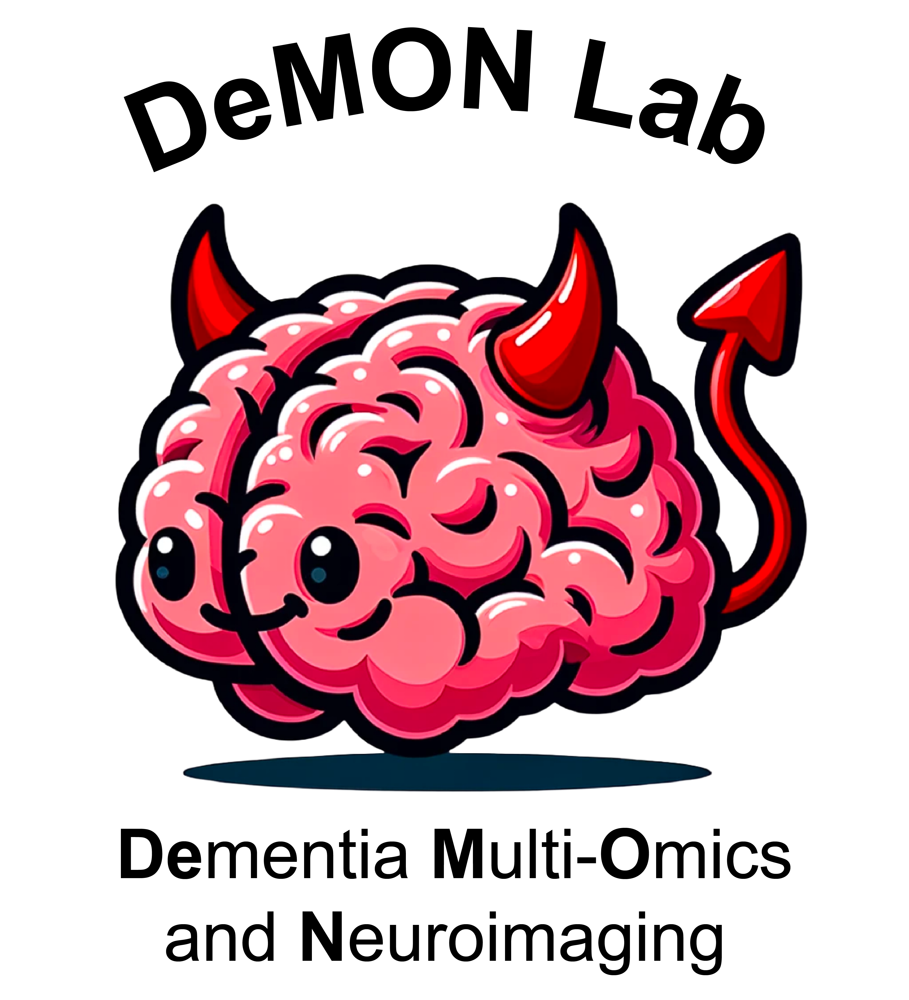

::: {.content-block}

{width=100%}

:::

::: {.content-block}

# Welcome to the DeMON Lab

We develop computational approaches integrating neuroimaging and multi-omics data to understand disease progression in Alzheimer’s and other neurodegenerative disease.

Our work combines statistical learning, disease progression modelling, neuroimaging, and molecular profiling to identify biologically meaningful disease subtypes and early pathological change.

[Our Research](projects.qmd){.btn .btn-primary .btn-lg}

[Publications](papers.qmd){.btn .btn-primary .btn-lg}

:::

::: {.content-block}

---

## About the Lab
🚧 Website updates in progress. More information coming soon.

Our lab’s main focus is in aging and neurodegenerative disease research, where we take advantage of large data resources to model disease progression and discover contributions to disease pathogenesis. Some of our lab’s principal research avenues include characterizing individual difference in disease progression, predicting the neurobiological progression of neurodegenerative diseases, and modeling the earliest biological changes that lead to neurodegenerative syndromes. Our work achieves these goals by blending large neuroimaging and multi-omic datasets, and applying to these datasets supervised and unsupervised methods in statistical learning and disease progression modeling.

Our research group is also privileged with a large network of collaborators that help push forward the lab’s research goals by providing both expert domain knowledge and rare datasets. The group boasts a sophistication in many statistical approaches and an expertise in many types of datasets. We also have a commitment to open science, FAIR principals and contributing to the greater research community.

## Latest News

🚧 Website updates in progress.

News from Linked In will appear here soon. In the meantime, check out our linked in!:

[LinkedIn](https://www.linkedin.com/company/demon-lab/posts/?feedView=all){.btn .btn-primary .btn-lg}

:::

::: {.content-block}

---

:::