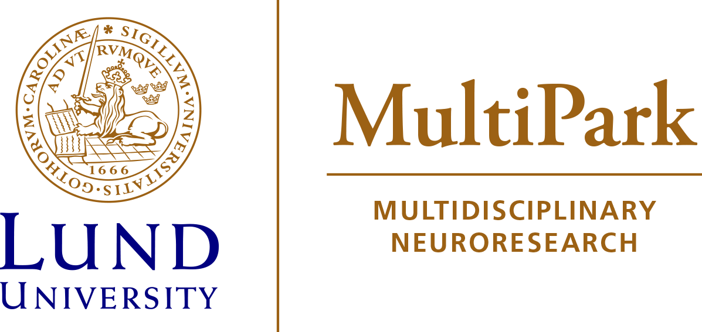

::: {.content-block}

{width=100%}

:::

::: {.content-block}

## Welcome!

In the DeMON Lab, we develop computational models that integrate neuroimaging and multi-omics data to understand disease progression and biological heterogeneity in neurodegenerative diseases.

Our work combines statistical learning, disease progression modelling, and molecular profiling to identify meaningful disease subtypes and biological changes associated with neurodegeneration.

:::

::: {.content-block}

## About the Lab
  
In the DeMON Lab, we investigate how neurodegenerative diseases develop and progress over time. Our research focuses primarily on Alzheimer’s disease but also other neurodegenerative disorders, with the goal of identifying biological changes at any stage of the disease, even those that precede clinical symptoms, and understanding why individuals experience disease differently.

To address these questions, we integrate large-scale neuroimaging, molecular, genetic, and clinical datasets. By combining statistical learning, disease progression modelling, and multi-omics approaches, we develop computational methods that model disease progression, reveal patterns of heterogeneity in these diseases, identify biologically meaningful subtypes, and improve our understanding of disease mechanisms.

Our research group is also privileged with a large network of collaborators that help push forward the lab’s research goals by providing both expert domain knowledge and rare datasets. 

We are committed to open and reproducible science, FAIR data principles, and the development of methods and resources that benefit the wider research community.

[Projects](projects.qmd){.btn .btn-primary .btn-lg}
[Publications](papers.qmd){.btn .btn-primary .btn-lg}

:::

::: {.content-block}

## Research Network

:::