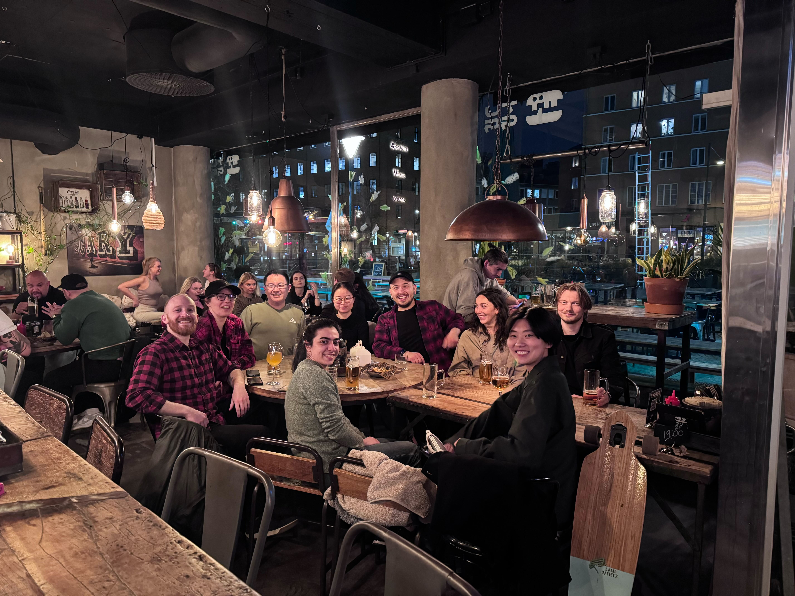

------------------------------------------

## Principal Investigator

:::{#pi}

:::

## Postdocs

:::{#postdocs}

:::

## Graduate Students

:::{#phds}

:::

## Research Assistants

:::{#ras}

:::

------------------------------------------

## Bachelor / Master Students

**Student Name 1**  
Thesis  
Program Name

**Student Name 2**  
Internship  
Program Name

**Student Name 3**  
Thesis  
Program Name

**Student Name 4**  
Project  
Program Name

**Student Name 5**  
Internship  
Program Name

**Student Name 6**  
Thesis  
Program Name

