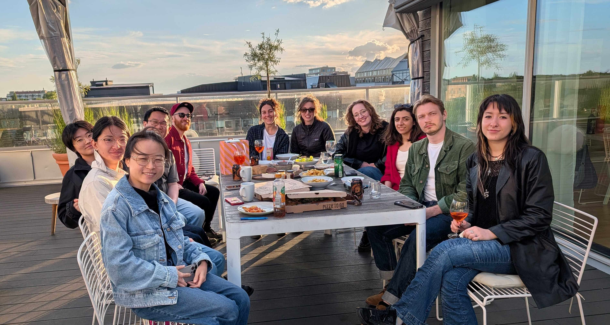

------------------------------------------

## Principal Investigator

:::{#pi}

:::

## Postdocs

:::{#postdocs}

:::

## Graduate Students

:::{#phds}

:::

## Research Assistants

:::{#ras}

:::

------------------------------------------

## Bachelor / Master Students

<strong>Nadine Li Pigida</strong> 
Project 
Master in Bioinformatics

<strong>Ruizhen Shen</strong> 
Master Thesis 
Machine Learning, Systems and Control

<strong>Yaqi Jiao</strong> 
Project 
Master in Bioinformatics

<strong>Elsa Gustafsson</strong> 
Internship 
Master in Biomedical Engineering

<strong>Catarina Barreiros</strong> 
Thesis 
Bachelor in Biomedicine

<strong>Emma Volcov</strong> 
Thesis 
Bachelor in Biomedicine

## Alumni
<strong>Malo Gicquel</strong>, Master student (2023) 
<strong>Alma Lennartsson</strong>, Master student (2025-2026)  

