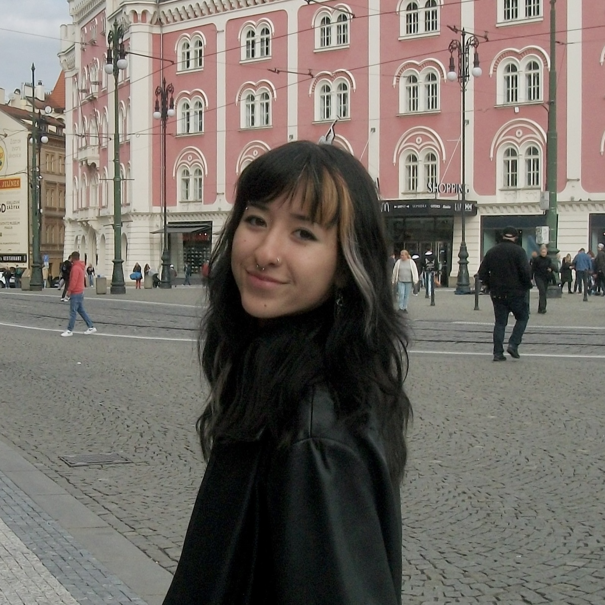
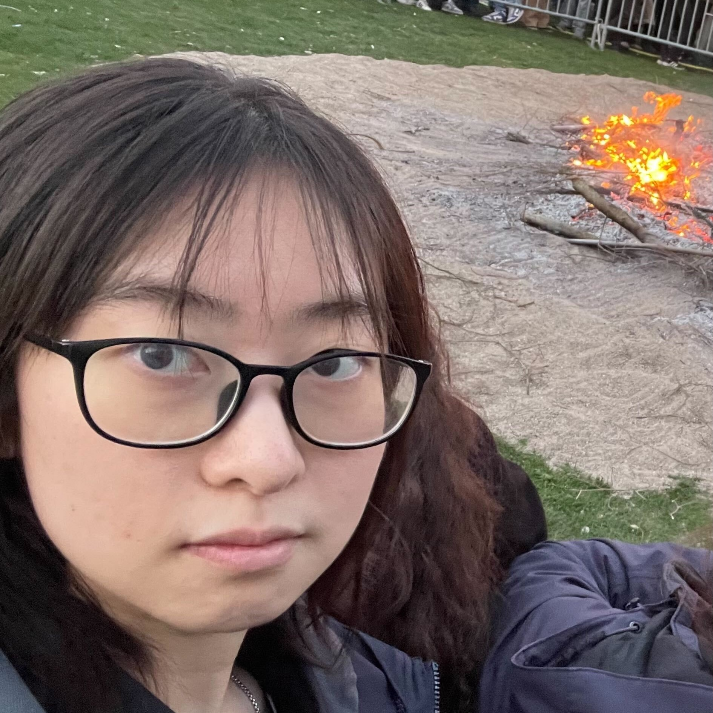
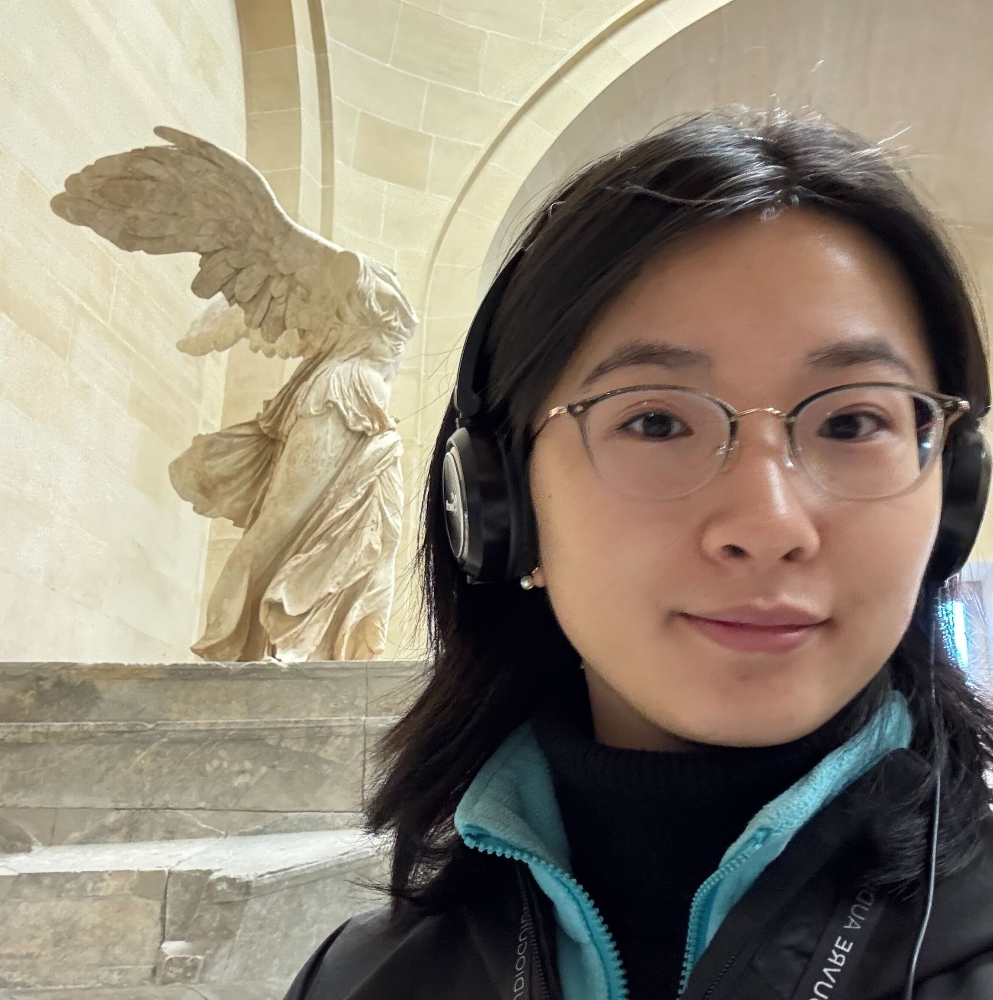
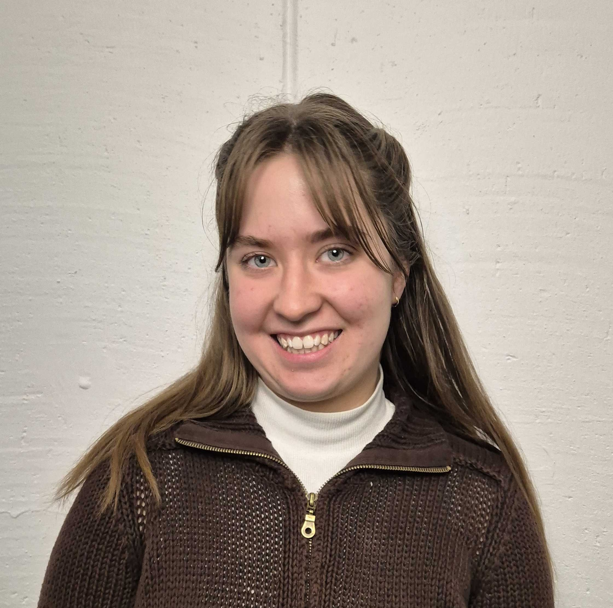
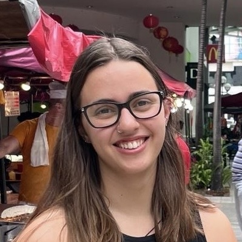
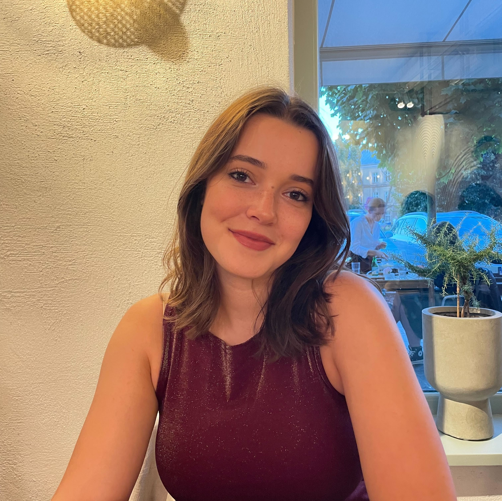

------------------------------------------

## Principal Investigator

:::{#pi}

:::

## Postdocs

:::{#postdocs}

:::

## Graduate Students

:::{#phds}

:::

## Research Assistants

:::{#ras}

:::

------------------------------------------

## Bachelor / Master Students

**Nadine Li Pigida**  
Project (Master)
Bioinformatics

**Ruizhen Shen**  
Master Thesis 
Machine Learning, Systems and Control

**Yaqi Jiao**  
Project (Master)  
Bioinformatics

**Elsa Gustafsson**  
Internship (Master)
Biomedical Engineering

**Catarina Barreiros**  
Bachelor Thesis  
Biomedicine

**Emma Volcov**  
Bachelor Thesis  
Biomedicine

